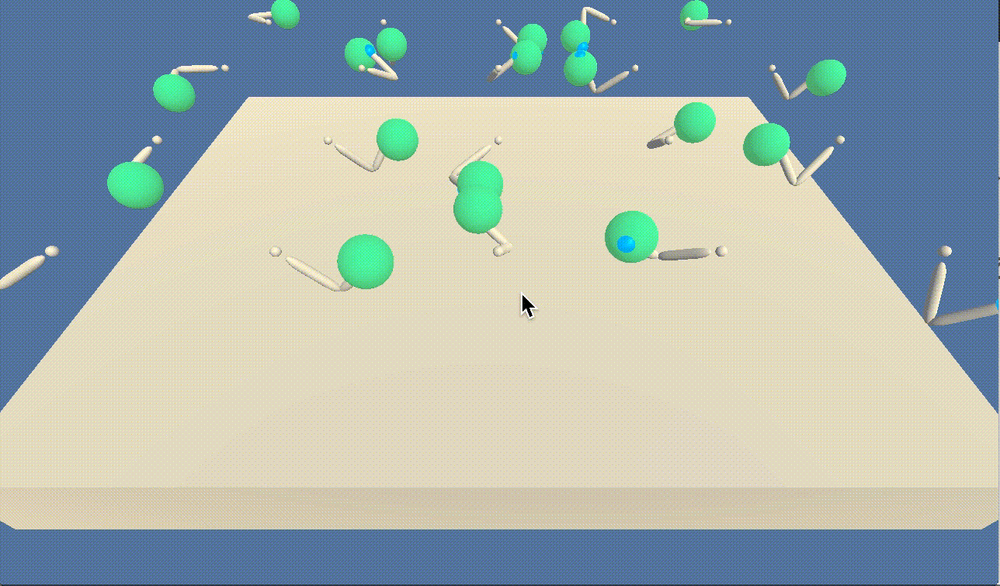

# Project Continuous Control

### Introduction

For this project, you will work with an environment called [Reacher](https://github.com/Unity-Technologies/ml-agents/blob/master/docs/Learning-Environment-Examples.md#reacher) environment.

In this environment, a double-jointed arm can move to target locations. Actually, use the env with 20 agents, so we will see 20 arms.

A positive reward is provided for each step that the agent's hand is in the goal location. Thus, the goal of the agent is to maintain its position at the target location for as many time steps as possible.

The observation space consists of 33 variables corresponding to position, rotation, velocity, and angular velocities of the arm. Each action is a vector with four numbers, corresponding to torque applicable to two joints. Every entry in the action vector should be a number between -1 and 1.

This is how a well trained agent looks like. Beautiful, isn't it?

### Unity Environment
After downloading the Unity Environment and saving it into the same folder where the main notebook `Continuous_Control.ipynb` sits, one can load the env by running the following code:

> `env = UnityEnvironment(file_name='Reacher.app')`
>
>  `brain_name = env.brain_names[0]`
>
>  `brain = env.brains[brain_name]`
>
>  `env_info = env.reset(train_mode=True)[brain_name]`

### Problem Definition and success criteria
In RL, any problem should be defined as MDP (Markov Decision Process) that consists of States, Actions, Reward function and Transition Function

#### States

The state space consists of 33 variables corresponding to position, rotation, velocity, and angular velocities of the arm. 
Given this information, the agent has to learn how to best select actions.  

One can check how the state vector looks like for one agent by running the following code:

> `state = env_info.vector_observations[0]`
> `print(state)`

#### Actions
Each action is a vector with four numbers, corresponding to torque applicable to two joints. 
Every entry in the action vector must be a number between -1 and 1. This is important, so we make sure in the code to clip actions to get to this.

One can check the number of actions by:

> `print(brain.vector_action_space_size)`

#### Rewards

A reward of +0.1 is provided for each step that the agent's hand is in the goal location. 

#### When the task is considered solved

Because we use the env with 20 agents, we must get an average score of +30 (over 100 consecutive episodes, and over all agents). 
Specifically:
- After each episode, we add up the rewards that each agent received (without discounting), to get a score for each agent.  This yields 20 (potentially different) scores.  We then take the average of these 20 scores. 
- This yields an **average score** for each episode (where the average is over all 20 agents).

The environment is considered solved, when the average (over 100 episodes) of those average scores is at least +30. 

### Getting Started

1. Clone the repository.
   
   git clone https://github.com/alinapopaqb/drl-reacher.git
 
2. To set up your python environment to run the code in this repository, follow the instructions below.
      
      Create (and activate) a new environment with Python 3.6.
      
      Linux or Mac:
      
      `conda create --name drlnd python=3.6`
      
      `source activate drlnd`
      
      Windows:
      
      `conda create --name drlnd python=3.6 `
      
      `activate drlnd`
      
3. Install the dependencies in the newly created env by running in the shell:
     
     `pip install -r requirements.txt`

4. Download the environment from one of the links below.  You need only to select the environment that matches your operating system:
        - Linux: [click here](https://s3-us-west-1.amazonaws.com/udacity-drlnd/P2/Reacher/Reacher_Linux.zip)
        - Mac OSX: [click here](https://s3-us-west-1.amazonaws.com/udacity-drlnd/P2/Reacher/Reacher.app.zip)
        - Windows (32-bit): [click here](https://s3-us-west-1.amazonaws.com/udacity-drlnd/P2/Reacher/Reacher_Windows_x86.zip)
        - Windows (64-bit): [click here](https://s3-us-west-1.amazonaws.com/udacity-drlnd/P2/Reacher/Reacher_Windows_x86_64.zip)
   
5. Place the file in the `continuous_control/` folder, and unzip (or decompress) the file. 

6. Create an IPython kernel for the drlnd environment:

    `python -m ipykernel install --user --name drlnd --display-name "drlnd"`

7. Run in the terminal of the current  directory:

    `jupyter notebook`

8. Go to the `Continuous_Control.ipynb` and run the code there based on the instructions.
